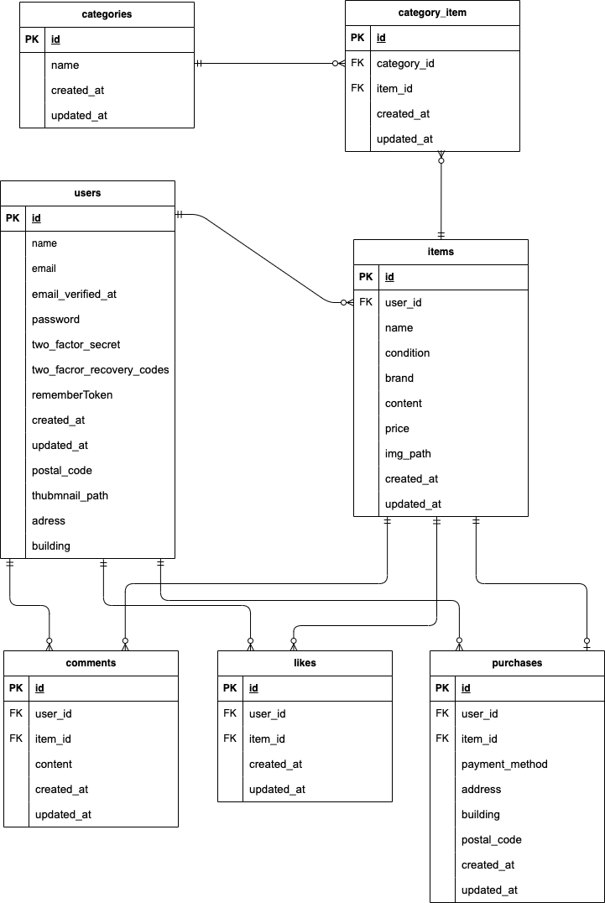
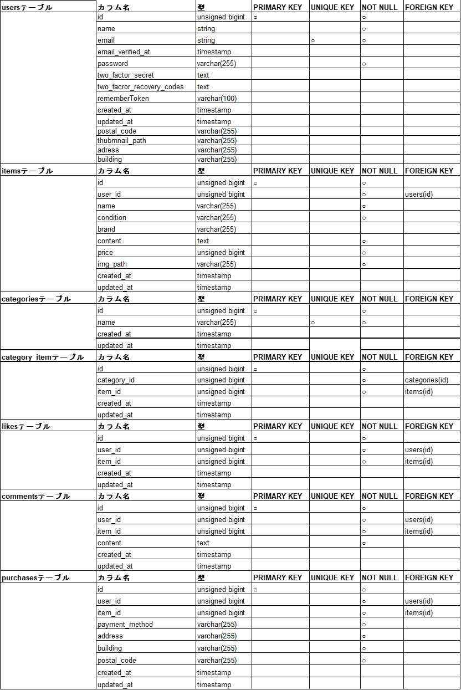

# Coahchtechフリマ

Coachtech模擬案件用のフリマアプリです。  

## 1 環境構築
1.1〜1.5までの環境環境構築を行なって下さい。

### 1.1 Dockerビルド
    1.コマンドラインにてディレクトリを指定およびDockerDesktopを立ち上げる。
    2.リポジトリをクローンする。
        git clone git@github.com:AKIOYAMADA408942/flima-app.git
    3.ディレクトリに移動
        cd　flima-app
    4.コンテナの生成および起動
        docker compose up -d --build  

### 　1.2 Laravel 環境構築  
    
    1.PHPコンテナに入る
        docker compose exec php bash
    2.Composer パッケージのインストール
        composer install
    3. .env.example ファイルをコピーして .env ファイルを作成
        cp .env.example　.env
    4. .env ファイルのデータベース設定を下記に変更
        DB_CONNECTION=mysql
        DB_HOST=mysql
        DB_PORT=3306
        DB_DATABASE=laravel_db
        DB_USERNAME=laravel_user
        DB_PASSWORD=laravel_pass
    5.laravelアプリケーションキーの生成
        php artisan key:generate
    6.データベースのマイグレーション
        php artisan migrate
    7.データベースに初期データの挿入
        php artisan db:seed
    8.シンボリックリンクの設定
        php artisan storage:link

初期データについて  
CategoryTableSeederクラスはアプリの動作に必要なカテゴリのデータの挿入になりますので必ず実行して下さい。

### 1.3 Stripe決済
    本アプリはstripe決済を利用しています.  
    https://stripe.com/jp にアクセスして、Stripeのアカウントを作成して下さい。作成後、2点の設定を行ってください。  

        1. Stripeにログインし、コンビニ支払いを有効にして下さい。順にクリック(ダッシュボードから設定(歯車)→製品の設定欄から決済→決済手段→コンビニ支払いを有効)  
        2. ダッシュボードからAPIキーを確認して .envファイルに下記欄を追記して下さい。

        STRIPE_KEY=　(公開キー)　　　　　
        STRIPE_SECRET_KEY= (シークレットキー)

### 1.4 メール認証
メール認証にmailtrapを使用しました。https://mailtrap.io/ja からアクセスしてアカウント登録をお願いします。ログインしたらサイドバーの「sandbox」->「inboxes」→「MyInbox」の順にクリック「IntegIntegrations」から「laravel7.x and 8.x」を選択し、記載のある下記項目をコピーして　.envファイルに上書きしてください。

MAIL_MAILER=  
MAIL_HOST=  
MAIL_PORT=  
MAIL_USERNAME=  
MAIL_PASSWORD=  
MAIL_ENCRYPTION=  

### 1.5 PHPUnit
テスト用のデータベースの作成および設定をします。  
1.mysql コンテナ上でrootユーザーでログイン  

    mysql -u root -p

2.passwordは[ root ]でログインし、テスト用データベース
(demo_test)の作成  

    CREATE DATABASE demo_test;

3.phpコンテナ内でテスト用のマイグレーションを実行  

    php artisan migrate --env=testing

4.　.env.testingファイルでAPP_KEY=　の値が空であることを確認してテスト用のlaravelアプリケーションキーを作成  

    php arisan key:generate --env=testing

## 2　テスト
試験的に動かす際、2.1〜２.３までお読みの上、動かして下さい。
### 2.1 ダミーデータおよびテストアカウント
メール認証済のテストアカウントを３つ用意しましたのでご活用ください。
商品のダミーデータは10点あります。

名前:test1  
Email: test1@example.com  
password: password
 
名前:test2  
Email: test2@example.com  
password: password
 
名前:test3  
Email: test3@example.com  
password: password

### 2.2 Stripe決済におけるテスト

カード支払いでテストする場合、https://docs.stripe.com/testing からテストカードの記載がありますのでご確認ください。

コンビニ支払いでテストする場合、印刷画面まで遷移したら、支払い完了は出来ないため、http://localhost//purchase/{item_id}/success からitem_idを指定して決済を完了して下さい。

### 2.3 PHPを用いたテスト
以下のテストを用意しました。各テスト終了毎にテーブルのドロップおよびマイグレーションを行います。

* 会員登録機能 (RegisterUserTest.php)
* ログイン登録機能 (LoginTest.php)
* ログアウト機能 (LogoutTest.php)
* 商品一覧取得 (ListItemTest.php)
* マイリスト一覧取得 (MylistTest.php)
* 商品検索機能(未実装) (SearchTest.php)
* 商品詳細情報取得 (DetailItemTest.php)
* いいね機能 (LikeTest.php)
* コメント送信機能 (CommentTest.php)
* 商品購入機能(未実装) (PurchaseTest.php)
* 支払い方法選択機能(未実装)
* 配送先変更機能(未実装) (AddressTest.php)
* ユーザー情報取得(未実装) 
* ユーザー情報変更 (ProfileTest.php)
* 出品商品情報登録 (SellTest.php)

各機能テストはphpコンテナ内で下記に上記の()内のファイル名を入れて実行して下さい。

    vendor/bin/phpunit tests/Feature/ファイル名

全てのテストを実行

    vendor/bin/phpunit

## 3 使用技術
DockerCompose 3.8  
laravel 8.83.29  
PHP 7.4.9  
nginx 1.21  
MySQL 8.0.26  
laravel Fortify  
Stripe  
Mailtrap  

## 4 ER図

## 5 データテーブル

## 6 URL
* 開発環境 http://localhost/
* phpMyAdmin http://localhost:8080/
* Mailtrap https://mailtrap.io/ja 
* Stripe  https://stripe.com/jp 

